# Basic Data Governance with Databricks
Repository for the D ONE blogpost for basic data governance using Databricks

Medium post link : 

### Recreating the Store Transactions example

In order to be able to recreate the example you need to have modification rights for a catalog, please contact your admin if you don't. Alternatively, see the following documentation if you need to create a new one: https://docs.databricks.com/en/data-governance/unity-catalog/create-catalogs.html. Note that the community edition does not have all the necessary features.

In the materials below the catalog is assumed to be named "store_data_catalog". Make sure you change it to the name of the catalog you are planning to work with.

### Steps

General:
* Download the DBC archive file from this repo
* Upload it to your workspace in Databricks via import file. It should contain: 1 notebook and 3 sql queries, as well as 2 folders: "data" containing a store_transactions_data.csv file and "images" containing files loaded into this readme.
* If needed - change the name of the catalog in the notebook (mind, there are multiple locations) and the sql queries
* Run the Notebook
* Review the result in the catalog. It should look similar to the following image:
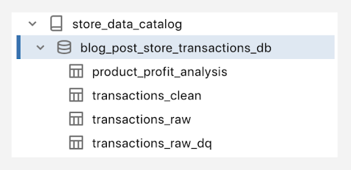
* Run the data quality queries. The simplest way to do is to open each of the queries and click on "Run".
* Configure visualisations and create a data quality dashboard (see additional instructions below)

#### Configuring visualisations

##### 1. Detailed health check report
Navigate to the query "blog_post_generating_dq_report". After execution there will appear a tab called "Results" at the bottom. Double click on the name "Results" and change it to something meaningful, such as "Full data quality check report". Click on the arrow next to the tab name and choose edit as indicated by the following image:

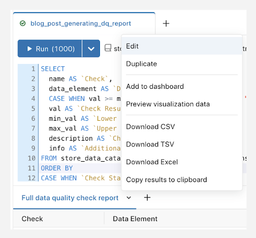

A window should open with options to configure the visualisation. In this case we are interested in a detailed, tabular report. Therefore, make sure the upper left corner shows "Table" under "Visualization type":

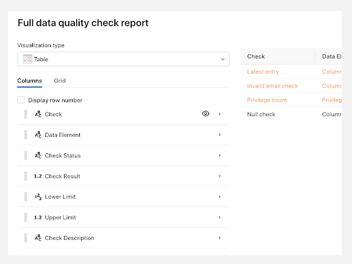

To draw attention to failed checks we would like to colour several attributes in orange. Click on each of the following attributes: "Check", "Data Element" and "Check Status" and add a condition as shown in the following image: 

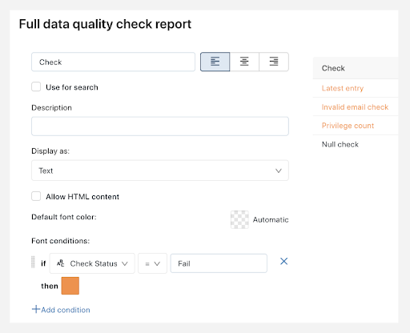

After clicking on "Save" at the bottom right corner navigate back to query, you should see the result at the bottom looking similar to the following image (mind, the exact values may be different):

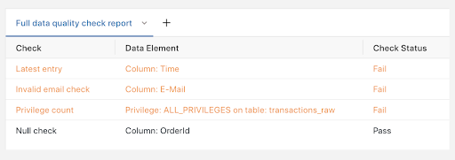

##### 2. Summary doughnut charts for data quality categories 
Navigate to the query "blog_post_dq_category_summary". Similarly to the steps in (1) rename the "Results" to something meaningful, such as "dq_summary_category". In the "Edit" pop-up choose "Pie" under "Visualization type" and set the X column to "Check Status" and the Y to Count (Sum). Group by the "check_type". Your configuration should be similar to this:

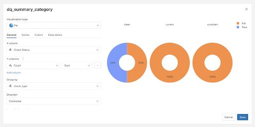

To set the colours navigate to the "Colors" tab and click on the colour to change it to the ones presented in the image below:

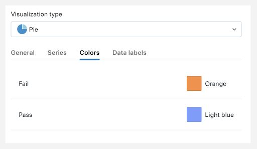

Your doughnut charts should look like in the previous image.

##### 3. General information regarding data checks execution:
Navigate to the query "blog_post_last_dq_execution". Similarly to the previous steps, rename the "Results" to something meaningful, such as "last_dq_execution". In the "Edit" pop-up choose "Details View"; it should now look like this:

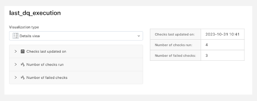

#### Creating a dashboard

You can create a dashboard from within a query. Navigate to one of the queries, for example to "blog_post_generating_dq_report". Click on the menu from next to one of results tabs (in which we configured the visualisations) and choose "Add to dashboard" as depicted here:

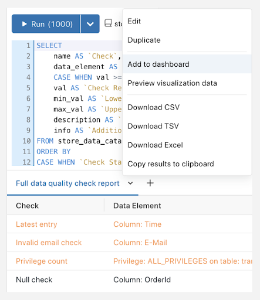

Click on "Create new dashboard" and choose a name, for example, "Store Transactions: Data Quality" and click on "Add", such as:

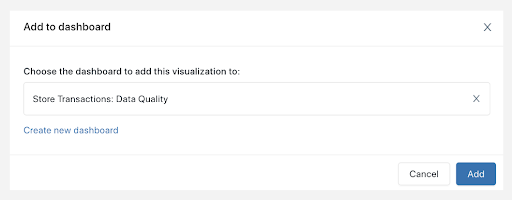

Choose the newly created dashboard and click on "Add".
Add the other two visualizations to the already existing dashboard.

From the menu on the left hand-side go to the "Dashboard" section. You should see the new dashboard there, similar to the following:

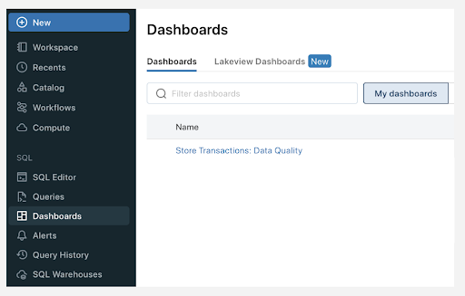

Having opened the dashboard, you should see the 3 visualisations looking somewhat messy. Choose "Edit" in the menu in the top-right corner (next to the "Refresh" button). Organise the dashboard by clicking and drag-and-dropping the different visualisations to the desired locations. The bottom right corner has an arrow that allows resizing (see the blue rectangle in the doughnut charts):

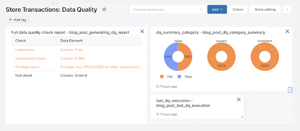

To modify the title, click on the settings of a visualisation and choose "Change widget settings":

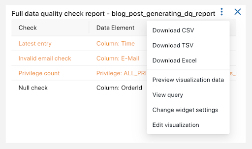

You can customise the title under "Customize the title for this widget":

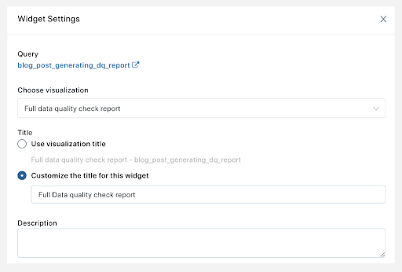

Once you are done reviewing other options don't forget to click "Save" at the bottom-right - you might need to scroll for this.

After applying all the changes click on "Done editing" at the upper right corner and voilà - your dashboard is ready :)